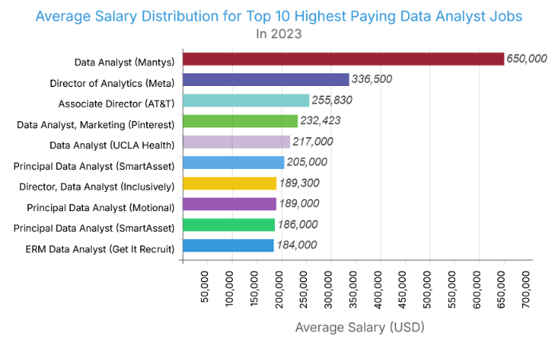
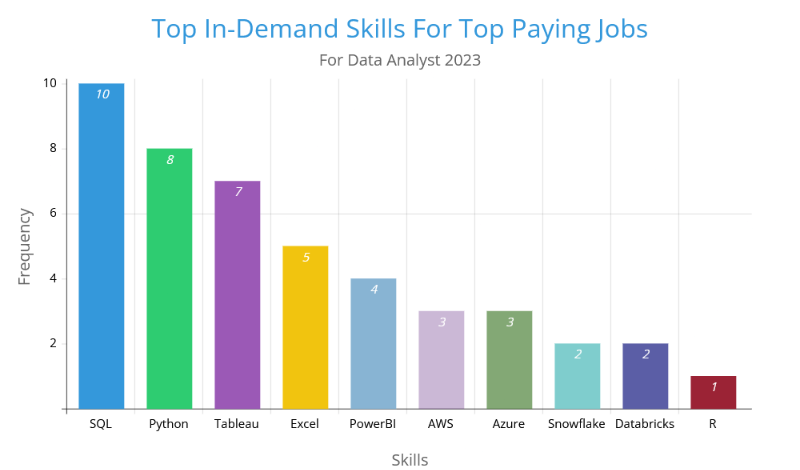

# Introduction 📊
This capstone project explores the **Data Analyst job market** 📈 using real-world job posting data from **2023** 💼.
It focuses on uncovering key insights about in-demand skills, remote opportunities, and salary trends 💰 to better understand what employers are really looking for.
Perfect for anyone aiming to break into data analysis or stay updated with current market needs! 🚀🔥

🔎**Check out the SQL queries here:** [project_sql folder](/project_sql/)

# Background 
With the tech industry evolving rapidly, the role of a **Data Analyst** has become more vital than ever.
I wanted to understand what employers are really looking for — **the skills, the tools, and the pay** that comes with it.

This project was born from that curiosity — to decode real job data and uncover valuable trends for anyone entering the data space.💡
As a student aiming to break into the data world,
## These are some of the questions I had:

1. What are the top-paying Data Analyst jobs?
2. What skills are required for the top-paying Data jobs?
3. What are the most in-demand skills for Data Analysts specifically?
4. What are the top skills based on salary?
5. What are the most optimal skills to learn (high demand and high paying skill)?

To answer these, I turned real job posting data into a structured analysis.📊
This project is my way of learning from the job market itself.

# Tools I Use 
To carry out this project smoothly and efficiently, I relied on a set of powerful tools commonly used in real-world data projects:

- **SQL** – The core language used to query and analyze the job market data.

- **PostgreSQL** – The database system used to store and process large job postings datasets efficiently.

- **Visual Studio Code** – My go-to code editor for writing, testing, and debugging SQL queries.

- **Git & GitHub** – For version control and showcasing this project on my GitHub portfolio.

# The Analysis
Each query for this project aimed at investigating specific aspects of the data analyst job market.
Here's how I approached each question:

## 1. Top Paying Data Analyst Jobs 
I filtered remote Data Analyst roles with available salary data and sorted them by average annual pay to find the top 10 highest paying positions. This query helped highlight the best-paying roles in the current job market.

```sql 
SELECT
    job_id,
    companies.name AS company_name,
    job_title,
    job_location,
    job_schedule_type,
    salary_year_avg,
    job_posted_date
FROM
    job_postings_fact AS job_postings
LEFT JOIN company_dim AS companies 
ON job_postings.company_id = companies.company_id 
WHERE
    job_title_short = 'Data Analyst' AND
    job_location= 'Anywhere' AND 
    salary_year_avg IS NOT NULL
ORDER BY 
    salary_year_avg DESC
LIMIT 10;
```
### Here’s the breakdown of the top 10 highest-paying remote Data Analyst jobs in 2023:

- **Salary Range**: Salaries vary significantly, from around $180,000 up to a standout $650,000, highlighting big rewards for senior-level roles.

- **Leadership Roles Lead**: The highest-paying positions are mostly Director and Principal Data Analyst roles, showing experience and responsibility pay off.

- **Top Employers**: Companies like Meta, AT&T, and Pinterest dominate the list, indicating big tech and established firms offer the best remote salaries.


*Bar graph visualizing the salary for the top 10 highest paying Data Analyst jobs in 2023. I made this bar chart from a free chart making website*

## 2. Skills Required for Top-Paying Data Analyst Jobs

Using the top 10 highest-paying remote Data Analyst roles from the first query, I pulled the required skills listed for each job. This reveals the key technical and analytical skills that consistently show up in high-paying roles — giving a clear roadmap for what to focus on when aiming for top-tier analyst positions.

```sql 
WITH top_paying_jobs AS (
    SELECT
        job_id,
        companies.name AS company_name,
        job_title,
        salary_year_avg
    FROM
        job_postings_fact AS job_postings
    LEFT JOIN company_dim AS companies 
    ON job_postings.company_id = companies.company_id 
    WHERE
        job_title_short = 'Data Analyst' AND
        job_location= 'Anywhere' AND 
        salary_year_avg IS NOT NULL
    ORDER BY 
        salary_year_avg DESC
    LIMIT 10
)

SELECT
    top_jobs.*,
    skills
FROM 
    top_paying_jobs AS top_jobs
INNER JOIN skills_job_dim ON top_jobs.job_id = skills_job_dim.job_id
INNER JOIN skills_dim ON skills_job_dim.skill_id = skills_dim.skill_id
ORDER BY
    salary_year_avg DESC
```
### Here's the breakdown of the most in-demand skills for top-paying Data Analyst jobs in 2023:
1. **SQL is Non-Negotiable:** 
    SQL was listed in every single one of the top 10 high-paying job postings. It’s the backbone of data querying, and clearly, employers expect analysts to be fluent in it, no matter the company or role level.
2. **Python & Tableau Are Top Tier Add-Ons:** 
    Python appeared in 8 out of 10 roles, showing its dominance for scripting, automation, and analysis. Tableau was also featured heavily (7 roles), emphasizing the value of clear, visual data storytelling. These two together significantly boost an analyst’s profile.
3. **Cloud & Data Engineering Tools Give You an Edge:** 
    Tools like AWS, Azure, Snowflake, Databricks, and Power BI were found in several of the top-paying listings. These suggest that top jobs often blur into data engineering and cloud environments, where knowledge of infrastructure and pipelines is a plus.


*Bar graph visualizing the frequency of top skills for top paying jobs for Data Analysts in 2023. I made this bar chart from a free chart making website*

## 3. What are the most in-demand skills for Data Analysts?
This query identifies the top 5 most frequently requested skills in all Data Analyst job postings, giving a clear picture of which skills are currently most sought-after in the job market — helping job seekers prioritize what to learn first.
```sql 
SELECT 
    skills,
    COUNT(skills_job_dim.job_id) AS demand_count
FROM 
    job_postings_fact
INNER JOIN skills_job_dim ON job_postings_fact.job_id = skills_job_dim.job_id
INNER JOIN skills_dim ON skills_job_dim.skill_id = skills_dim.skill_id
WHERE
    job_title_short = 'Data Analyst' AND
    job_work_from_home= TRUE
GROUP BY
    skills
ORDER BY
    demand_count DESC
LIMIT 5;
```
### Key Insights: Most In-Demand Skills for Data Analysts

1. **SQL Dominates the Market**: 
With 7,291 job postings, SQL is the most in-demand skill for Data Analysts — a foundational requirement for almost every role in the field.

2. ***Excel and Python are Essential**:
Excel (4,611) and Python (4,330) are neck-and-neck in demand, showing that both traditional and programming-based data handling remain vital.

3. **Data Visualization is Highly Valued**:
Tableau (3,745) and Power BI (2,609) emphasize how important it is for Data Analysts to communicate insights visually — a skill companies clearly prioritize.

| Skill     | Number of Job Postings |
|-----------|------------------------|
| SQL       | 7,291                  |
| Excel     | 4,611                  |
| Python    | 4,330                  |
| Tableau   | 3,745                  |
| Power BI  | 2,609                  |
*Result set of the top 5 in-demand skills for Data Analyst Jobs*

## 4. What Are the Top Skills Based on Salary?

This query investigates which technical skills are associated with the highest-paying Data Analyst roles. Instead of focusing on just a few top jobs, it looks at all roles with disclosed salaries, offering a broader perspective on which individual skills bring in more money across the industry.

By joining job postings with the skills data, we calculate the average salary linked to each skill and sort them to see which ones consistently lead to better compensation.

This helps answer the key question:
**"Which skills should I learn or improve if I want to increase my earning potential as a Data Analyst?"**

```sql
SELECT 
    skills,
    ROUND(AVG(salary_year_avg),0) AS avg_salary
FROM 
    job_postings_fact
INNER JOIN skills_job_dim ON job_postings_fact.job_id = skills_job_dim.job_id
INNER JOIN skills_dim ON skills_job_dim.skill_id = skills_dim.skill_id
WHERE
    job_title_short = 'Data Analyst' AND
    salary_year_avg IS NOT NULL
    AND job_work_from_home= TRUE
GROUP BY
    skills
ORDER BY
    avg_salary DESC
LIMIT 25;
```
### Here’s what we found when analyzing which skills are most associated with higher salaries in Data Analyst job listings (with specified salary data):

1. ***Niche = $$$***:
Skills like PySpark, Bitbucket, and Couchbase aren’t as commonly listed in general Data Analyst roles — but when they are, they’re associated with very high salaries (above $150K), showing that specialized or less common tools can be incredibly lucrative.

2. ***Data Engineering Tools***: Are Hot
Frameworks like Databricks, Airflow, Jupyter, and Kubernetes suggest that skills bordering on Data Engineering / ML Ops are driving higher salaries in analyst roles too — especially for hybrid roles.

3. ***Python Ecosystem Pays Well***:
Libraries like Pandas, NumPy, Scikit-learn, and Jupyter prove that strong Python skills — especially in data wrangling and ML — are well rewarded, and clearly in demand for higher-level analyst roles.

| Skill           | Average Salary (USD) |
|----------------|----------------------|
| PySpark         | $208,172             |
| Bitbucket       | $189,155             |
| Couchbase       | $160,515             |
| Watson          | $160,515             |
| DataRobot       | $155,486             |
| GitLab          | $154,500             |
| Swift           | $153,750             |
| Jupyter         | $152,777             |
| Pandas          | $151,821             |
| Elasticsearch   | $145,000             |
| Golang          | $145,000             |
| NumPy           | $143,513             |
| Databricks      | $141,907             |
| Linux           | $136,508             |
| Kubernetes      | $132,500             |
| Atlassian       | $131,162             |
| Twilio          | $127,000             |
| Airflow         | $126,103             |
| Scikit-learn    | $125,781             |
| Jenkins         | $125,436             |
| Notion          | $125,000             |
| Scala           | $124,903             |
| PostgreSQL      | $123,879             |
| GCP             | $122,500             |
| MicroStrategy   | $121,619             |

*Result set of the query*

## 5. 🎯 Optimal Skills to Learn for Data Analysts (High Demand × High Salary)

To identify the most valuable skills for aspiring Data Analysts, we analyzed remote job listings that:
- Specify salaries
- Mention skills explicitly

By focusing on both **demand count** (how often a skill appears in listings) and **average salary**, we found the **top-performing skills** that offer both:
- 📈 High market **demand**
- 💰 High **financial rewards**

These are the **most strategic skills** to prioritize if you're aiming for a secure, high-paying data analyst career — especially in remote positions.
```sql
SELECT
    skills_dim.skill_id,
    skills_dim.skills,
    COUNT(skills_job_dim.job_id) AS demand_count,
    ROUND(AVG(job_postings_fact.salary_year_avg),0) AS avg_salary
FROM
    job_postings_fact
INNER JOIN skills_job_dim ON job_postings_fact.job_id = skills_job_dim.job_id
INNER JOIN skills_dim ON skills_job_dim.skill_id = skills_dim.skill_id
WHERE
    job_title_short = 'Data Analyst' AND 
    salary_year_avg IS NOT NULL AND 
    job_work_from_home = TRUE
GROUP BY 
    skills_dim.skill_id
HAVING 
    COUNT(skills_job_dim.job_id)> 10 
ORDER BY 
    avg_salary DESC, 
    demand_count DESC
LIMIT 25;
```
### Key Insights on Optimal Skills for Data Analysts

- **High Demand Leaders:** Python and Tableau top the list with the highest job demand, making them must-have skills for anyone targeting remote Data Analyst roles. Both offer solid salaries around $100K+.

- **Cloud & Big Data Advantage:** Skills like Go, Snowflake, Azure, AWS, and Hadoop not only pay well (often $110K+) but are growing in importance, showing where the industry is headed.

- **Specialized Skills = Premium Pay:** Niche tools like Confluence, SSIS, and Jira may have fewer openings but offer lucrative salaries, proving that focused expertise can open high-paying opportunities.

| Skill        | Demand Count | Avg Salary (USD) |
|--------------|---------------|------------------|
| Go           | 27            | $115,320         |
| Confluence   | 11            | $114,210         |
| Hadoop       | 22            | $113,193         |
| Snowflake    | 37            | $112,948         |
| Azure        | 34            | $111,225         |
| BigQuery     | 13            | $109,654         |
| AWS          | 32            | $108,317         |
| Java         | 17            | $106,906         |
| SSIS         | 12            | $106,683         |
| Jira         | 20            | $104,918         |
| Oracle       | 37            | $104,534         |
| Looker       | 49            | $103,795         |
| NoSQL        | 13            | $101,414         |
| Python       | 236           | $101,397         |
| R            | 148           | $100,499         |
| Redshift     | 16            | $99,936          |
| Qlik         | 13            | $99,631          |
| Tableau      | 230           | $99,288          |
| SSRS         | 14            | $99,171          |
| Spark        | 13            | $99,077          |
| C++          | 11            | $98,958          |
| SAS          | 63            | $98,902          |
| SQL Server   | 35            | $97,786          |
| JavaScript   | 20            | $97,587          |

*Table: Top skills for remote Data Analyst roles based on demand and average salary in USD.*


# 🧠 What I Learned

- **SQL Proficiency Boost:** This project significantly improved my confidence with SQL. I learned how to write clean, readable queries using `JOINs`, `GROUP BY`, `ORDER BY`, `CTEs`, `subqueries`, and `aggregate functions`.

- **Data Storytelling Through Queries:** Beyond just pulling numbers, I learned how to extract meaningful, actionable insights from raw data — like identifying the most in-demand skills or highest paying roles for Data Analysts.

- **Real-World Analytics Thinking:** I understood how to break down a broad question into smaller analytical steps and structure queries to reflect real-world business decision-making.

- **Hands-on with Career-Focused Data:** Working with real job data gave me exposure to trends in tech hiring, helping me understand which tools, platforms, and languages are actually valuable in the market today.

- **Better Query Structuring:** This was my first time working on a multi-question SQL project — I learned how to organize queries logically and annotate them properly for reusability and clarity.


# Conclusions
### 📌 Insights Summary

1. **Python, SQL, Tableau, and Excel** remain the most *consistently in-demand core skills* for Data Analysts — they appear frequently across job listings, especially for remote roles.

2. **Data Scientist** and **Data Engineer** roles often offer higher salaries than standard Data Analyst roles, indicating lucrative career growth paths for analysts who upskill.

3. **Skills like PySpark, Bitbucket, and Couchbase** command *premium salaries*, even with lower demand — making them high-reward but niche investments.

4. Some skills such as **Looker, AWS, Azure, and Snowflake** strike the *perfect balance* of demand and salary — making them *optimal targets* for upskilling.

5. Companies are increasingly expecting familiarity with **cloud platforms, big data tools, and collaborative environments** (like Git, Jira, Confluence), indicating a shift toward modern, team-driven data ecosystems.

### 🧠 Closing Thoughts

This project marked a huge step in my data journey — from learning SQL basics to extracting real-world insights from job data. It not only sharpened my technical skills but also gave me a deeper understanding of how data analysis directly connects to career decisions. I'm now more confident in reading job trends, understanding what companies value, and planning which tools to learn next. This is just the beginning, and I’m excited to build more impactful projects moving forward.


